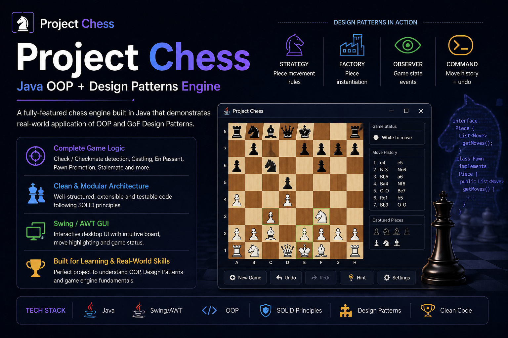

<div align="center">



<br/>

# Project Chess

### A fully-featured chess engine built in Java — demonstrating real-world OOP, GoF Design Patterns, and game engine architecture.

<br/>

[](https://www.java.com)
[](https://docs.oracle.com/javase/8/docs/technotes/guides/swing/)
[](https://refactoring.guru/design-patterns)
[](https://en.wikipedia.org/wiki/SOLID)
[](LICENSE)

<br/>

[Overview](#-overview) · [Design Patterns](#-design-patterns-breakdown) · [Architecture](#-system-design--architecture) · [Features](#-features) · [Run](#-how-to-run) · [Structure](#-code-structure)

</div>

---

## 🧭 Overview

Project Chess is a **complete, rule-compliant chess engine** with an interactive Swing/AWT GUI. What differentiates this from a typical game project is the deliberate application of **Gang of Four (GoF) design patterns** and **SOLID principles** — each architectural decision made to maximize modularity, testability, and extensibility.

The engine handles the full complexity of chess rules, a rendering pipeline, and an event-driven input model — structured as a mini game engine, not a monolithic application.

**Engineering highlights:**
- 4 GoF patterns applied where they solve real design problems — not forced
- Full move validation pipeline with rule isolation per piece type
- Command-based move history enabling unlimited undo/redo
- Observer-driven state propagation — UI never polls, only reacts
- Designed so adding a new piece type requires **zero changes** to existing classes

---

## 🎯 Features

**Complete Chess Rules Engine**
- ♟️ Legal move generation for all 6 piece types
- ♟️ Check and checkmate detection
- ♟️ Stalemate detection
- ♟️ Castling (kingside and queenside, with full precondition validation)
- ♟️ En passant capture
- ♟️ Pawn promotion

**GUI & Interaction**
- Interactive board rendered via Swing/AWT
- Mouse-driven piece selection and move execution
- Move highlighting — valid squares shown on selection
- Captured pieces panel, move history log, game status indicator
- Undo / Redo via toolbar or keyboard shortcut

**Architecture**
- Separation of game logic, rendering, and input handling
- Extensible piece model — new piece types require no modifications to existing code
- Clean state management — board state is always consistent and inspectable

---

## 🧠 Design Patterns Breakdown

This is the core engineering section. Each pattern was chosen to solve a **specific design problem** — not applied for the sake of it.

---

### ♟️ Strategy Pattern — Piece Movement Rules

**Problem:** Each chess piece has unique movement logic. Without Strategy, this devolves into a giant `switch` or `instanceof` chain inside a single movement method — fragile and closed to extension.

**Solution:** Each piece type implements a `MovementStrategy` interface with a `getLegalMoves(Board board, Position position)` method. The `Piece` class delegates movement calculation to its assigned strategy.

```java
interface MovementStrategy {
    List<Move> getLegalMoves(Board board, Position position);
}

class KnightMovementStrategy implements MovementStrategy {
    @Override
    public List<Move> getLegalMoves(Board board, Position position) {
        // L-shaped logic isolated here
    }
}
```

**Why it improves design:**
- Adding a new piece (e.g., a fairy chess variant) = implement one interface, plug in
- Movement logic is independently testable per piece type
- Zero coupling between `Piece` and movement rules — Open/Closed Principle in action

---

### 🏭 Factory Pattern — Piece Instantiation

**Problem:** Creating pieces during board setup requires conditional construction logic scattered across the codebase. Direct instantiation couples the caller to concrete piece classes.

**Solution:** A `PieceFactory` encapsulates piece creation. The caller requests a piece by type and color — the factory returns the correctly configured object with the right strategy assigned.

```java
class PieceFactory {
    public static Piece create(PieceType type, Color color) {
        return switch (type) {
            case KNIGHT -> new Piece(color, new KnightMovementStrategy());
            case BISHOP -> new Piece(color, new BishopMovementStrategy());
            // ...
        };
    }
}
```

**Why it improves design:**
- Board setup and piece creation are fully decoupled
- Strategy assignment is centralized — one place to change piece behavior
- Supports future extension (e.g., loading custom pieces from config)

---

### 👁 Observer Pattern — Game State Events

**Problem:** Multiple UI components (status panel, move log, captured pieces panel) need to react when game state changes. Directly calling each component from the game logic creates tight coupling and violates SRP.

**Solution:** `Game` implements a publisher. UI components register as `GameEventListener` subscribers. On state change (move executed, check detected, game over), the game notifies all registered observers.

```java
interface GameEventListener {
    void onMoveMade(Move move);
    void onCheckDetected(Color kingColor);
    void onGameOver(GameResult result);
}

class StatusPanel implements GameEventListener {
    @Override
    public void onCheckDetected(Color kingColor) {
        statusLabel.setText(kingColor + " is in check!");
    }
}
```

**Why it improves design:**
- Game logic has zero knowledge of the UI — Dependency Inversion preserved
- Adding a new UI component (e.g., an audio cue system) requires only registering a new listener
- State changes propagate automatically — no polling, no stale UI

---

### ⏪ Command Pattern — Move Execution + Undo/Redo

**Problem:** Supporting undo/redo requires storing enough information to reverse any move. Without Command, this means ad-hoc state snapshots or deeply coupled reverse-logic in the board class.

**Solution:** Every move is encapsulated as a `MoveCommand` object with `execute()` and `undo()` methods. A `MoveHistory` stack manages the command log.

```java
interface MoveCommand {
    void execute();
    void undo();
}

class StandardMoveCommand implements MoveCommand {
    private final Board board;
    private final Move move;
    private Piece captured; // saved on execute, restored on undo

    @Override
    public void execute() {
        captured = board.getPieceAt(move.getTo());
        board.movePiece(move);
    }

    @Override
    public void undo() {
        board.movePiece(move.reversed());
        if (captured != null) board.placePiece(captured, move.getTo());
    }
}
```

**Why it improves design:**
- Undo/redo is an O(1) stack operation — no board diffing required
- Complex moves (castling, en passant) are self-contained in their own command subclass
- Move history is a first-class object — trivially serializable for game save/replay

---

## ⚙️ System Design & Architecture

### Game Engine Pipeline

```
Mouse Input
    │
    ▼
InputHandler
(translates click → board position)
    │
    ▼
MoveValidator
(checks legality: rules + board state)
    │
    ▼
MoveCommand.execute()
(applies move to Board, saves state for undo)
    │
    ▼
Game.notifyObservers()
(broadcasts event to all UI listeners)
    │
    ▼
BoardRenderer + StatusPanel + MoveLog
(each independently re-renders from new state)
```

### Event Handling Model

Input is fully decoupled from game logic. The flow is:

1. **Input Layer** — `MouseListener` captures click coordinates, maps to `Position(row, col)`
2. **Selection Phase** — first click selects a piece and requests legal moves from its `MovementStrategy`
3. **Validation Phase** — `MoveValidator` filters moves that would leave the king in check
4. **Execution Phase** — confirmed move is wrapped in a `MoveCommand` and executed; board state updates atomically
5. **Notification Phase** — `Game` fires events; all registered `GameEventListener`s react independently

### State Management

The `Board` is the single source of truth. It holds:
- An 8×8 grid of `Optional<Piece>` — null-safe by design
- Active color (whose turn it is)
- En passant target square
- Castling rights (bitmask per side)

State is **never mutated speculatively** outside of `MoveCommand.execute()`. Move generation operates on a **cloned board** to test check conditions — the real board is only modified after validation passes.

### Move Validation Pipeline

```
Raw candidate move
    → Is destination reachable by piece's MovementStrategy?
    → Does move respect board boundaries?
    → Is destination occupied by own piece?
    → After move, is own king in check? (simulated on clone)
    → Special rule checks (castling path clear? en passant conditions met?)
    → ✅ Legal move
```

---

## 🗂 Code Structure

```
ProjectChess/
├── engine/
│   ├── Board.java               # Board state, piece placement
│   ├── Game.java                # Game lifecycle, observer management
│   ├── MoveValidator.java       # Full legality pipeline
│   └── MoveHistory.java         # Command stack (undo/redo)
│
├── model/
│   ├── Piece.java               # Piece entity (delegates to strategy)
│   ├── Move.java                # Move value object
│   ├── Position.java            # (row, col) value object
│   ├── PieceType.java           # Enum: KING, QUEEN, ROOK, BISHOP, KNIGHT, PAWN
│   └── Color.java               # Enum: WHITE, BLACK
│
├── patterns/
│   ├── strategy/
│   │   ├── MovementStrategy.java          # Interface
│   │   ├── KnightMovementStrategy.java
│   │   ├── BishopMovementStrategy.java
│   │   └── ...                            # One class per piece type
│   ├── factory/
│   │   └── PieceFactory.java
│   ├── observer/
│   │   ├── GameEventListener.java         # Interface
│   │   └── GameEventType.java
│   └── command/
│       ├── MoveCommand.java               # Interface
│       ├── StandardMoveCommand.java
│       ├── CastlingMoveCommand.java
│       └── EnPassantMoveCommand.java
│
├── gui/
│   ├── BoardRenderer.java       # Paints board + pieces
│   ├── InputHandler.java        # Mouse events → game actions
│   ├── StatusPanel.java         # GameEventListener — shows turn/check
│   ├── MoveLogPanel.java        # GameEventListener — move history
│   └── CapturedPiecesPanel.java # GameEventListener — captured display
│
└── Main.java                    # Entry point — wires everything together
```

**Key design decisions in structure:**
- `patterns/` package is explicitly named — communicates intent, not just grouping
- Each `MoveCommand` subclass handles its own undo logic — no polymorphic branching
- GUI components are *only* `GameEventListener`s — they hold zero game state

---

## 🚀 How to Run

### Prerequisites
- Java 17+
- Any IDE (IntelliJ IDEA recommended) or terminal with `javac`

### Clone & Run

```bash
git clone https://github.com/mayankSystems/ProjectChess.git
cd ProjectChess
```

**Via IDE:**
Open the project → run `Main.java`

**Via Terminal:**
```bash
# Compile
javac -d out -sourcepath src src/Main.java

# Run
java -cp out Main
```

### Controls

| Action | Input |
|---|---|
| Select piece | Left click on piece |
| Move piece | Left click on highlighted square |
| Undo last move | `Ctrl+Z` or Undo button |
| Redo move | `Ctrl+Y` or Redo button |
| New game | New Game button |

---

## 🔮 Future Enhancements

- [ ] **AI opponent** — Minimax with alpha-beta pruning; `MovementStrategy` abstraction makes the engine AI-ready without modification
- [ ] **PGN import/export** — load/save games in standard Portable Game Notation; Command pattern makes this trivial
- [ ] **Opening book** — preloaded opening tree for hints and AI play
- [ ] **Network multiplayer** — serialize `MoveCommand` objects over sockets for peer-to-peer play
- [ ] **Puzzle mode** — load board positions and validate player solutions
- [ ] **Stockfish integration** — pipe moves to/from Stockfish via UCI protocol for analysis mode

---

## 👤 Author

<div align="center">

**Mayank** · Backend Engineer

[](https://github.com/mayankSystems)
[](https://www.linkedin.com/in/mayanksystems)

</div>

**Open to:** SDE2 / Senior Backend Engineer roles · Java · System Design · Clean Architecture

> This project exists to demonstrate that OOP isn't just syntax — it's a design discipline. Every pattern here solves a real problem. Happy to walk through any architectural decision in detail.

---

<div align="center">

⭐ **Star this repo** if it helped you understand design patterns in a real codebase.

*Project Chess — Java OOP + Design Patterns Engine*

</div>